## Creating a Portfolio for your job 

Follow my medium for such amazing projects : [Medium📓](https://medium.com/@ravikumar10593)

First, if you want to create a website you must be very clear with the purpose of the website and what type of people will be going to consume that website, so to answer both the question let’s take an example if you are a college student and want to create a portfolio that you can attract recruiters to hire you and make you stand out of the queue, this is why it is important to know your purpose and consumer.

> **_NOTE:_**  Let’s stick with the portfolio example for this article

Now next question creating a website from scratch will take a huge amount of time, to save time you can use : [Link]("https://bootstrapmade.com/?source=post_page-----d5265918bc8f--------------------------------")

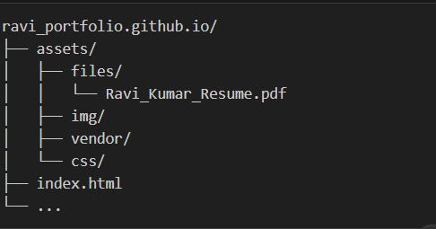

Click Templates and choose your purpose, it has a lot of options to choose from.
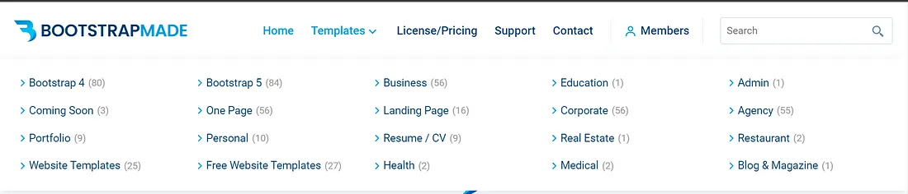

In the portfolio section, you have 9 different options to choose from and you can see 3 options below this,

- You can live play and have a look at how this is going to look
- You can download it for free
- You can pay for this and the Bootstrap team will provide you the support

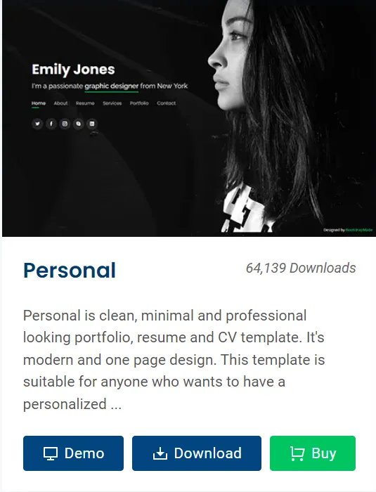

As I promised in the Article Title this will be going to be a free solution, so click on the download option and start modifying the index.html page.

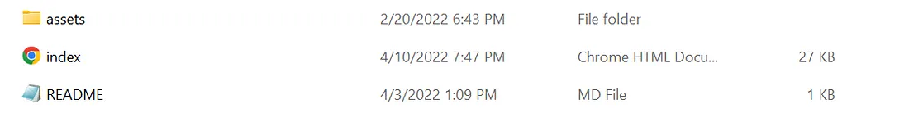

Open the index.html page with Visual Studio, Notepad, Notepad++ any app you want.

You won’t face any problem since they have commented very well and the code is very clean so, just change it as per your requirement and you are ready to go.

Find the assets/img/image below for reference :

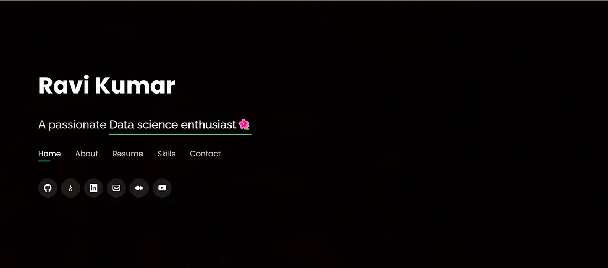

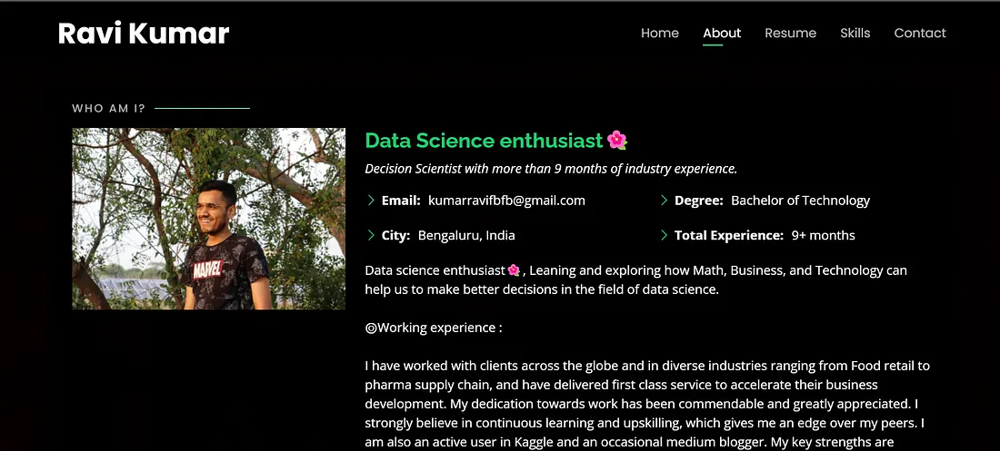

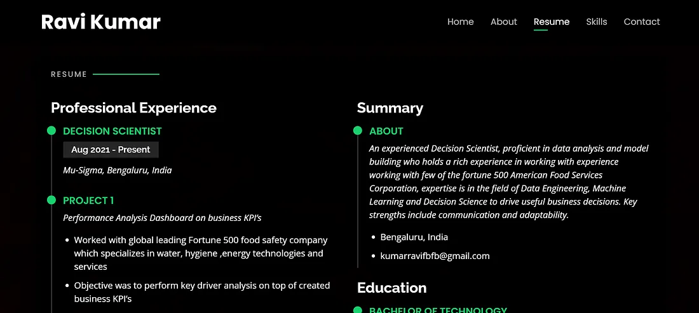

## Publish your Website for free

We will be using this same website and going to make it live on google using GitHub(Github is a website for developers and programmers to collaboratively work on code).

You can create a new account if you don’t have any now, it is very simple (A lot of youtube videos are also available on this).

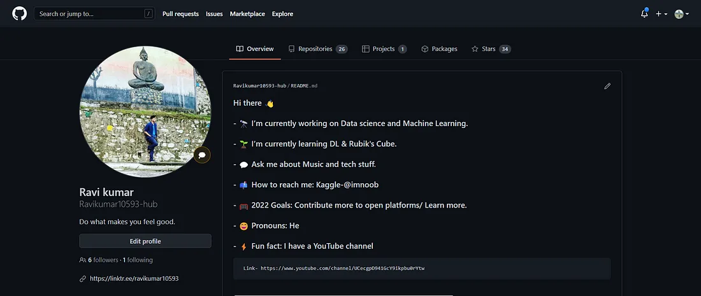

Click the top right + icon and click new repository.
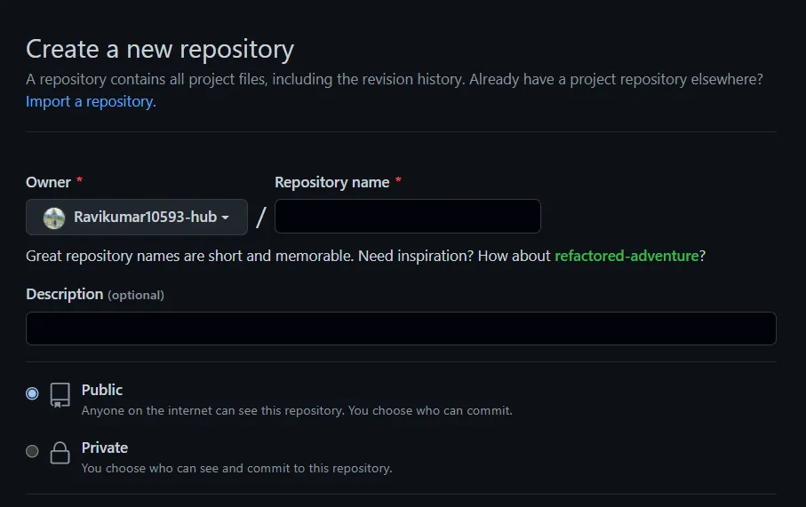

Name your repo like this: Your_desired_name.github.io

Example: ***ravi_portfolio.github.io***

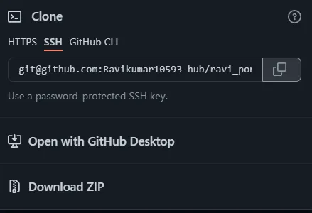

Copy the SSH code and go to the Github desktop app.

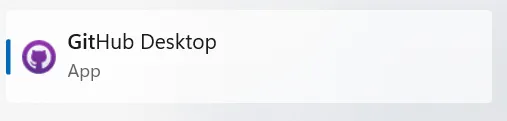

Download link: https://desktop.github.com/

Sign in with your GitHub account and click Add and clone repository.

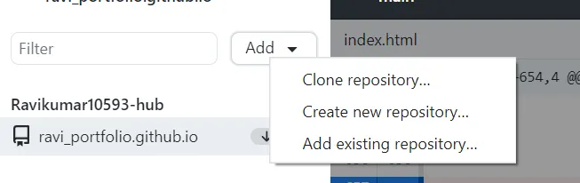

Find your repo that you had created earlier

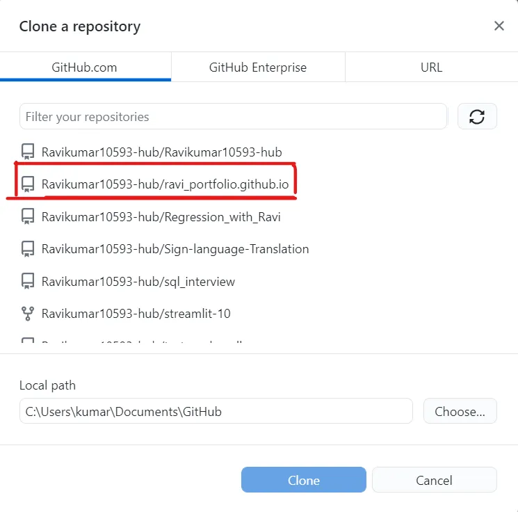

Click Clone and you can see something like this

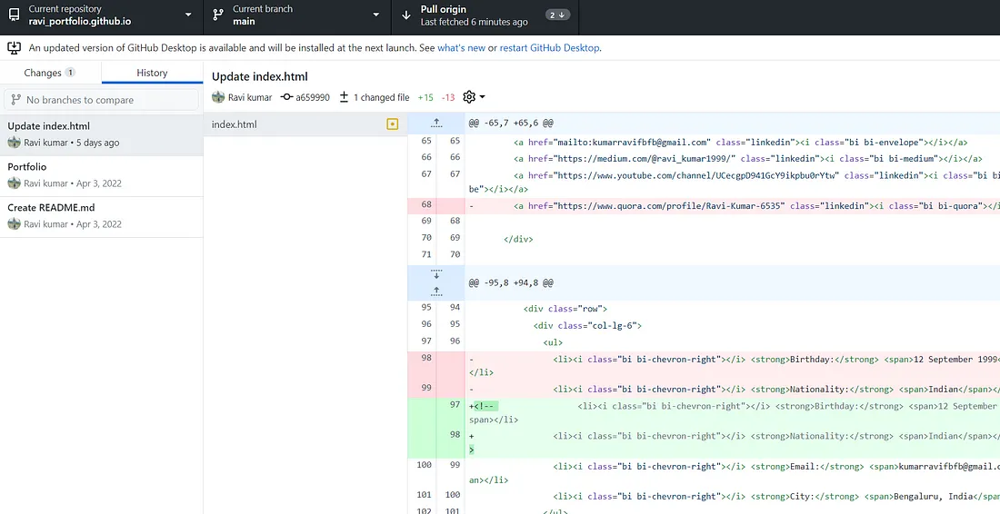

If you have any modifications to make, do them and add some basic description if the commit button is not working else just commit it.

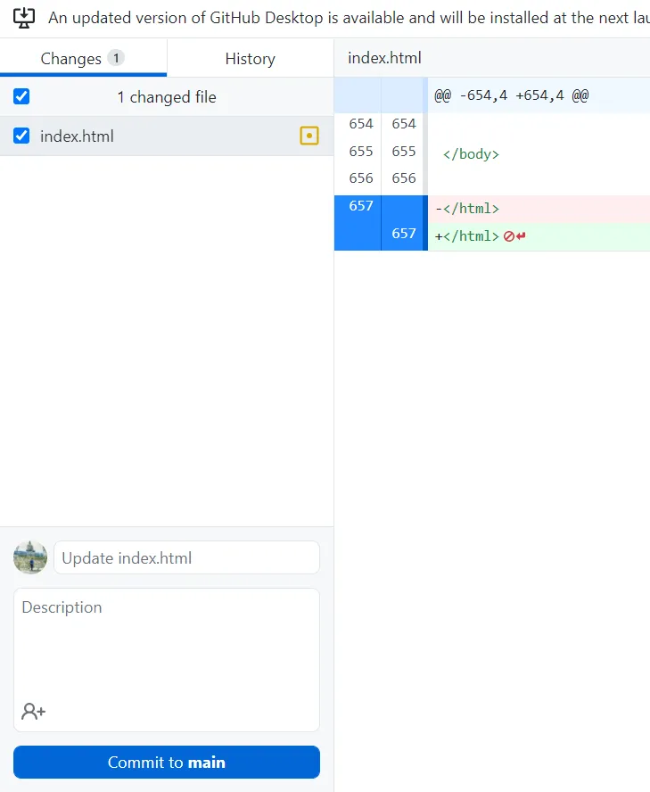

Go back to the GitHub page and click the settings tab.

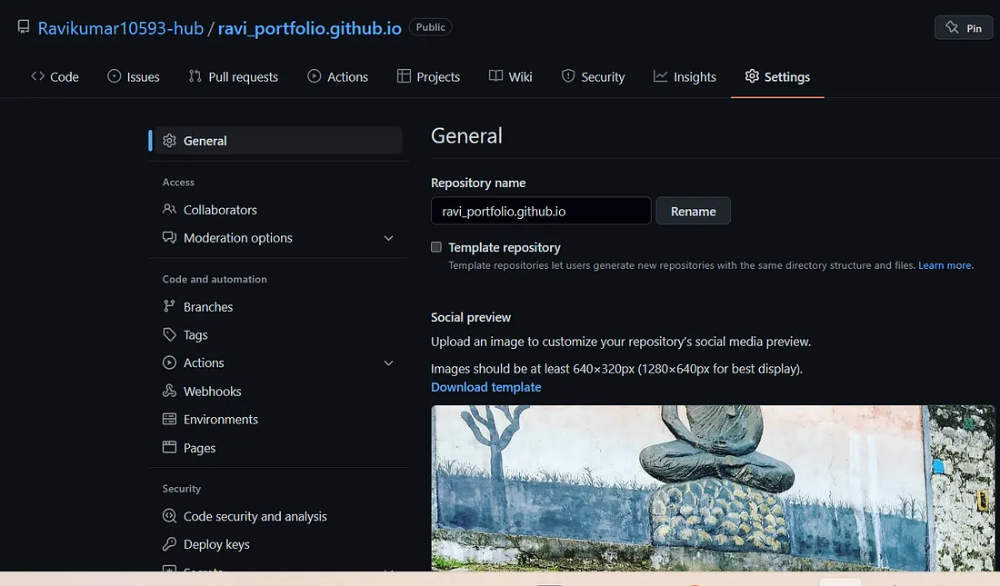

Choose the root branch & click the page box your site is published now, come back to the code tab and then go back to the Github page you will see that your site is published.

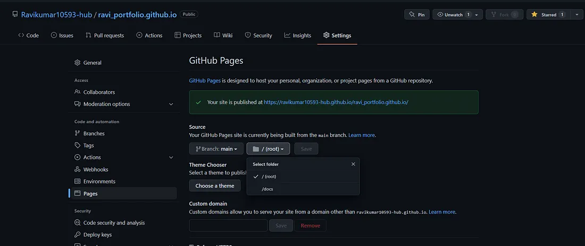

Click the [link](https://ravikumar10593-hub.github.io/ravi_portfolio.github.io/?source=post_page-----d5265918bc8f--------------------------------) to view your page.

